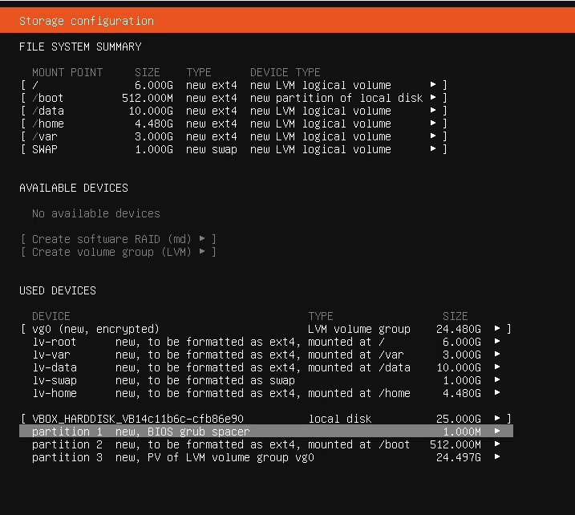
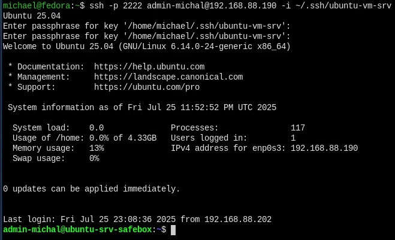
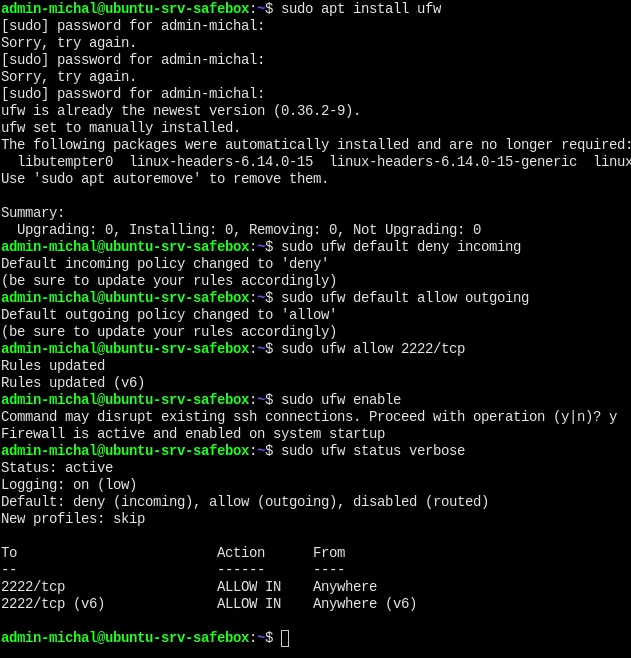
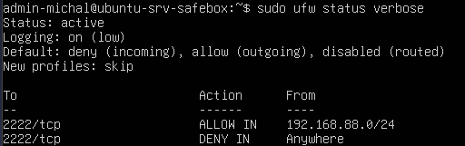
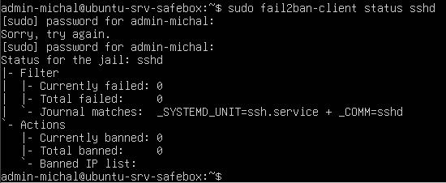

# Ubuntu Server Hardening

## Goals of the project
Set up secure Ubuntu server that ready to work with and easy to maintain.

`Ubuntu` is a Linux distribution that uses easy to use installer and `apt` packet manager. This distro is however not recomended by security purists.

---

## Step 1: Creating a VM and installing the system on it
- I've used `VirtualBox` because I'm comfortable with using it however this can be easly done using any hypervisor.

- I'm using LVM and encryption to make data secure even if hardware would be stolen.



---

## Step 2: Securing SSH
- I'm changing settings inside /etc/ssh/sshd_config:

```bash
Include /etc/ssh/sshd_config.d/*.conf
Port 2222
LogLevel VERBOSE
LoginGraceTime 30
PermitRootLogin no
MaxAuthTries 3
PasswordAuthentication no
PermitEmptyPasswords no
ChallengeResponseAuthentication no
KbdInteractiveAuthentication no
UsePAM yes
AllowAgentForwarding no
AllowTcpForwarding no
X11Forwarding no
PrintMotd no
ClientAliveInterval 300
ClientAliveCountMax 2
Banner /etc/issue.net
AcceptEnv LANG LC_* (May leak the Locale info)
Subsystem sftp /usr/lib/openssh/sftp-server
```

Also
```
ChallengeResponseAuthentication no KbdInteractiveAuthentication no
```
If you want 2FA, these need to be enabled. Disabling rules out MFA via PAM.

and we need to change settings in files inside `/etc/sshd_config.d/` directory(!!!)

This command may be helpful if you still have errors like me (Use this to find what is changing your settings in /etc/ssh directory):

```bash
sudo grep -Eir 'match|password' /etc/ssh
```

- Next I'm generating keys on host.

```bash
ssh-keygen -t rsa -b 4096 -f ~/.ssh/ubuntu-vm-srv
```

And we need to copy the .pub key to server directory: ~/.ssh/ to file authorized_keys. For this we can use copy-paste to another window.

- After all we can restart SSH:

```bash
sudo systemctl restart ssh
```

- Test:



---

## Step 3: 
Next step is installing and setting up Firewall rules. I've used for this project `UFW (Uncomplicated Firewall)` On Fedora I'm using `firewalld` and I haven't decided which one is better.

```bash
sudo apt install ufw
sudo ufw default deny incoming
sudo ufw default allow outgoing
sudo ufw allow 2222/tcp
sudo ufw enable
sudo ufw status verbose
```



After all I've decided to change this a little bit to be more secure. I don't expect users outside the internal network to connect to this server.
So I did:

```bash
sudo ufw allow from 192.168.88.0/24 to any port 2222 proto tcp
sudo ufw deny in to any port 2222 proto tcp
```

and then I clean up other rules
```bash
sudo ufw status numbered
sudo ufw delete [x]
```



---

## Step 4: Setting up Fail2Ban
Firstly I need to install some packages:

```bash
sudo apt install fail2ban rsyslog iptables -y
```

Then we need to create a configuation file (Do not edit: `jail.conf`)

```bash
sudo cp /etc/fail2ban/jail.conf /etc/fail2ban.local
```

Editing `jail.local`

```bash
sudo nano /etc/fail2ban/jail.local
```
I use `ctrl+w` to search for [sshd] and change the settings to:

```bash
[sshd]
enabled = true
port = 2222
bantime = 600
maxretry = 5
logpath = /var/log/auth.log
```
Then I need to configure the rsyslog

```bash
sudo nano /etc/rsyslog.d/50-default.conf
```

create a line:

```bash
auth,authpriv.*     /var/log/auth.log
```

and restart:

```bash
sudo systemctl restart rsyslog
sudo systemctl restart fail2ban
```

and check:

```bash
sudo fail2ban-client status sshd
```



You can check the test of simillar setup on my monitoring project here: https://github.com/mprofesor/linux-admin-portfolio/blob/main/monitoring.md


## Step 5: Scripts for creating unprivillaged users and groups
I've decided to write scripts for adding and removing users just for the future simplicity. (This scripts are strictly for this example but they can be modified for more wide usage)

### create_tech.sh

```bash
#!/bin/bash

# Create 'technicians' group if it doesn't exist
GROUP="technicians"
if ! getent group "$GROUP" > /dev/null; then
        echo "Creating group '$GROUP'..."
        sudo groupadd "$GROUP"
else
        echo "Group '$GROUP' already exists"
fi

# Ask for username
read -p "Enter technician username: " USERNAME

# Chceck if user exists
if id "$USERNAME-tech" &>/dev/null; then
        echo "User '$USERNAME-tech' already exists. Exiting."
        exit 1
fi

# Generate a random password (16 chars, base64 "safe")
PASSWORD=$(openssl rand -base64 12)

# Create the user, add to group, create home, and set shell
sudo useradd -m -s /bin/bash -G "$GROUP" "$USERNAME-tech"

# Set password for the user
echo "$USERNAME-tech:$PASSWORD" | sudo chpasswd

# Force password expiration (password must be changed on first login)
sudo chage -d 0 "$USERNAME-tech"

# Optionally set password expiration date (e.g., 7 days from now)
sudo chage -E $(date -d "+7 days" +%Y-%m-%d) "$USERNAME-tech"

echo "User '$USERNAME-tech' created."
echo "Temporary password: $PASSWORD"
echo "Password will expire on first login and must be changed."

echo "Note: Password expiration set for 7 days from now."

```

and

### purge_technicians.sh

```bash
#!/bin/bash

GROUP="technicians"

# Check if group exists
if ! getent group "$GROUP" > /dev/null; then
        echo "Group '$GROUP' does not exist. Nothing to delete."
        exit 0
fi

# Get list of users in the group
USERS=$(getent group "$GROUP" | awk -F: '{print $4}' | tr ',' ' ')

if [ -z "$USERS" ]; then
        echo "No users found in group '$GROUP'."
        exit 0
fi

echo "Users in group '$GROUP' to be deleted: $USERS"

# Loop and delete users
for user in $USERS; do
        read -p "Do you want to delete user '$user'? [y/N]: " confirm
        case "$confirm" in
                [yY][eE][sS]|[yY])
                        echo "Deleting user: $user"
                        sudo deluser --remove-home "$user"
                        ;;
                *)
                        echo "Skipping user: $user"
                        ;;
        esac
done

# Final confirmation to delete the group itself
read -p "Do you want to delete the group '$GROUP' itself? [y/N]: " delgroup
case "$delgroup" in
        [yY][eE][sS]|[yY])
                echo "Deleting group '$GROUP'"
                sudo groupdel "$GROUP"
                ;;
        *)
                echo "Group '$GROUP' not deleted."
                ;;
esac

echo "All users in group '$GROUP' have been deleted."
echo "Script completed."

```

This two scripts work fine for creating users and setting their expiration dates. Also it forces user to change password after logging in so it is known by them and they are responsible for what they are doing. We could also add `shell wrapper` to monitor every single move of the user by creating logs from history of commands user enters but this stays for the future.

## Step 6: Enabling automatic updates && logging
### Automatic updates
Maintaining system up-to-date is crucial point in security and integrity of the system so I decided to set up automatic updates for it.

```bash
sudo apt install unattended-upgrades apt-listchanges
```

after installation:

```bash
sudo dpkg-reconfigure --priority=low unattended-upgrades
```

and pick `yes`. 

to see what was installed and when execute:

```bash
cat /var/log/unattended-upgrades/unattended-upgrades.log
```

add a line to the `/etc/apt/apt.conf.d/10periodic`:

```bash
APT::Periodic::Unattended-Upgrade "1";
```


### Logging

```bash
sudo mkdir -p /var/log/journal
sudo systemd-tmpfiles --create --prefix /var/log/journal
sudo systemctl restart systemd-journald
journalctl --since "1 hour ago"
```

Short:

I'm creating non temporary storage for our logs and change the path of logging to this directory.

Deep:

`sudo mkdir -p /var/log/journal`
What it does:

    mkdir -p: Creates a directory and any needed parent directories (-p), but doesn’t fail if it already exists.

    /var/log/journal: This is the default location for persistent logs in systemd-journald.

Why it matters:

    By default, systemd-journald logs are stored in /run/log/journal, which is in memory (tmpfs) and erased on reboot.

    Creating /var/log/journal tells systemd-journald to switch to persistent logging.

    Journald will automatically detect this directory and start saving logs permanently (using binary .journal files).

Note:

    Must be owned by root and accessible only by privileged users (systemd-journal, adm, etc).

    Proper permissions are typically auto-handled.


`sudo systemd-tmpfiles --create --prefix /var/log/journal`
What it does:

    Tells systemd-tmpfiles to create or manage temp files/directories based on rules in /usr/lib/tmpfiles.d/ or /etc/tmpfiles.d/.

    The --prefix limits it to just /var/log/journal entries.

Why it matters:

    Even though we already created the dir manually, this ensures:

        Correct ownership, permissions, ACLs.

        Applies policy from tmpfiles.d configuration (e.g., rotation, cleanup policy).

    It’s essentially a "repair/normalize" step to make the journal directory compliant.


`sudo systemctl restart systemd-journald`
What it does:

    Restarts the journald logging daemon (systemd-journald.service).

    On restart, journald:

        Re-reads its config: /etc/systemd/journald.conf

        Scans for persistent storage directories like /var/log/journal

        Switches from volatile to persistent mode if configured

Why it matters:

    Journald doesn’t immediately switch to persistent logging just because the directory was created.

    A restart ensures it activates persistent mode and starts writing logs to disk.


`journalctl --since "1 hour ago"`
What it does:

    Queries logs from journald and displays all logs generated in the last hour.

    --since is a powerful time filter. It understands:

        Natural language ("yesterday", "2 hours ago")

        Exact timestamps (--since "2025-08-01 15:00")

What happens under the hood:

    Journald reads its binary log database from:

        /run/log/journal/... (volatile, if persistent logging is disabled)

        /var/log/journal/... (persistent, if enabled)

    Filters entries based on timestamp metadata and streams them out in human-readable format.

Output can include:

    Timestamps

    System services (via SYSLOG_IDENTIFIER)

    Kernel logs

    SSH logins, sudo activity, etc.

### TO BE CONTINUED